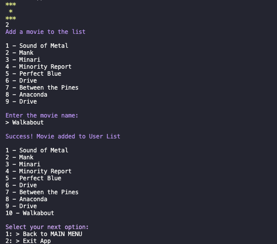

# Oscars Judge Terminal App

 

Oscars Judge Terminal App gives you the opportunity to be your own judge on the Academy Awards nominees and winners. Favourite movies, randomise movie selections and stay upto date with award winners.
 Create:

- Create a **User Profile**,
- **Personalise lists** of your Favourite Oscars movies and To Watch Lists,
- Can't decide what to watch? **Randomise** best picture movies and be directed to streaming sites,
- **Save and return** at any time.

 [Git Hub Source Respository](https://github.com/leberSmeaton/portfolioT1A3)

 
 

## Installation

This Oscars Judge Terminal App has,

- System Requirements,
- Ruby 3.0.1 installed for operation,
- Ruby Gem Bundler Install to run gem dependencies,
- Command Line Arguments available.

  [**Ruby 3.0.1** install information here,](https://www.ruby-lang.org/en/documentation/installation/#rubyinstaller)

- **Homebrew (macOS)** 
  Ruby versions 2.0 and above are included by default in macOS releases since at least El Capitan (10.11). [Homebrew](https://brew.sh/) is a commonly used package manager on macOS. Installing Ruby using Homebrew is easy:

  `$ brew install ruby`

  - You may already have ruby installed on your computer. To check which version is installed type in your terminal emulator, 
    `$ ruby --version`

- [rbenv](https://github.com/rbenv/rbenv#readme) to manage multiple installations/versions of Ruby. [rbenv](https://github.com/rbenv/rbenv#readme) allows you to manage multiple installations of Ruby.

  - To update to version required, 
    `$ rbenv install -list` 
    #select from available versions 
    #set to global version... 
    `$ rbenv install 3.0.1` 
    #check ruby version 
    `ruby --version`

- **Windows**  
  Check our the [**RubyInstaller**](https://rubyinstaller.org/) as it gives you everything to set up a full Ruby environment.

- **Linux/UNIX**  
  You can use the package management system of your distribution or third-party tools ([rbenv](https://github.com/rbenv/rbenv) and [RVM](http://rvm.io/)).
  Debian GNU/Linux and Ubuntu use the apt package manager. You can use it like this: 
  - `$ sudo apt-get install ruby-full`

  **Ruby Install Bundler** to manage the Oscars Judge Terminal App gem dependencies. The app utilises the following gems: _Colorize, TTY-link, TTY-font, Pastel, TTY-spinner._

- Bundler is an easy way to install all gem dependencies.
- Check to see if you have bundler installed.
- `$ bundler -v`
- OR install, `$ gem install bundler`

  **Downloading Oscars Judge** -
You've made it to the GitHub repo! Choose to download the ZIP folder or clone the repository to your computer.

- To run, open your terminal,
- Locate the src folder and ensure it is your working directory,
- Within the src directory run `$ bundler install` to ensure Ruby gem dependencies are all installed.
  - Either `$ ruby index.rb`
  - OR, use simple execution once `$ chmod +x ./run_program.sh` to run.
  - AFTER, running chmod the first time you can use `$ ./run_program.sh`.
- You can find other information about the app by using the following flags,
  - `$ ruby index.rb - help` for help
  - `$ ruby index.rb - info` for info
  - `$ ruby index.rb - instructions` for instructions on how to play
     
     
     

# Oscars Judge Terminal App

 
[Git Hub Source Respository](https://github.com/leberSmeaton/portfolioT1A3)

## Statement of Purpose

### Purpose

The Oscars Judge Terminal App is a multi-user, multi-session Oscar's experience, presenting the user with information on the nominees and winners of every annual Academy Awards category.
Users can create a profile to store 'Favourite List' and 'To Watch List', and set ratings on the movies they loved and hated (feature not yet available). If users can't decide on a movie to watch next, the Randomise feature will choose for you!

### The Problem

The Oscars Judge app creation idea came from loving to watch movies, but spending hours deciding what to watch. Creating lists is great, but having a random selection for you takes the ease off decision making.

- Never knowing 'what's good?',
- Indecisive decision makers,
- Spending too much time searching for movies,
- Quick links to watch movie instead of searching online for streaming.

### Target Audience

- The indecisive user who finds it difficult to find quality movies. The 'Random Movie Selector' will narrow down the search for the user, provide a movie choice and exiting the app to watch.
- The avid moviegoer who wants to keep tabs on their favourites and to watch lists. Users can return and start from where they left off to update their profiles and discover what to watch next.

### User Interaction

**README[.]md**

- As seen above, The README.md file provides the user instructions on the install requirements to run the Oscars Judge Terminal App. The README.md also provides the user instructions on how to navigate the app using up and down arrow keys rather than a mouse click or numerical.

 **Flags**

- Built into the Oscars Judge Terminal App is a -help flag that will also give a rundown of requirements and how to navigate and any other features the User needs to be informed about.
- Other flags include -instructions and -info for the app.

 

**Gems**

- Pastel, Colorize & TTY-font
  - For creating a attractive user interface. Boosting readability of headings and creating points of difference.
- TTY-link
  - Providing hyperlinks for users when they arrive at end points of their movie searches. Allows the users to quickly leave the app and be diverted to their film of choice. This works as an end point for the To Watch list feature.
- TTY-spinner
  - Creating DRY code by removing repetitive code, double the size of of the spinner code. Showing realtime wait times and creating build up for revealing features such as the Randomise feature.

## Features

### User Profile Creation

Allows a user to create a profile that stores the data they create and remembers it for future sessions. The User Profile Creation caters to multiple users.

- On creation of a new user, the data is stored in an array which is assigned as a variable defined by the users name. name = $bella ?
- Within the array profile we store @watchlist and @favourite variables that can be called in creating new lists. Are these global variables?
- when a user is attempting to make a profile a conditional conditional control structure will check if the name contains any invalid numbers or symbols. This is where 'invalid name' error handling will take place. 

 
 

### Creating New Lists

is for @watchlist and @favourite lists and is defined by the user and stored in the user profile txt file. User lists can be accessed whilst in the main menu.

- User List acts as a defacto User Profile and favourites list with the option to add and delete movies.
- If nothing has been saved in the lists a 'nothing saved' error message is printed.
  

- @watchlist and @favourite are not an accessible feature at this time due to not being able to connect class variables to main menu 5: and 6:.
- Here we can see the watchlist and favourite list being saved locally to it's method.
  
   
   

### Randomise Movies

When a user can't choose what movie to watch they have the option in the main menu to randomly output a movie from the entire movie list. On selection it executes watch now and exits user directly to an external website youtube trailer link.

- It randomises the variable movies names and their youtube link value.
- Loop control structure for random variable movie name output. On answer user has conditional control structure to 'watch now' and exit or 'go back' to main menu.
- possible error handling if user receives movies that they have favourited. 

 
 

### Saving Sessions & Exiting App

Saving session is setup initially by User Profile Creation feature. It allows users to return to where they left off.

- When users decide to exit the program their data is automatically saved into their profile txt file created at the start of the session. The @watchlist and @favourites arrays are also stored in the txt file.
- All end points offer a conditional control structure before exiting 'are you sure'? If no, it loops back into main menu selection.
- Error messages must be displayed if saving does not complete at exit. 

 
 

# Software Development Plan

- ### App-flow

  

- ### Data-flow

  

- ### Interface-flow

  

- ### User Direction Stories
  

## Implementation Plan

Using [Trello as project management software](https://trello.com/b/4HGN7XKp/t1a3) for keeping track.

- Board Feature
  
- Early Stages
  
- Around Midway
  
- Towards Conclusion
  

 

[GitHub](https://github.com/leberSmeaton/portfolioT1A3) for version control.

- 
- 

## Help Documentation

## Testing

### RSPEC

Initial testing for RSPEC worked on the early versions of Oscars Judge Terminal App, but as the app changed, had to be refactored and eventually removed. Here are some images of that process. The current process isn't working as intended and I haven't been able to remove all the method errors and failures.

### Error Handling

Feature Lists is not operating or available as it should be and so I've included error handling to show two different outcomes. Both @watchlist instance variable and @favourite instance variables are arrays that aren't holding any information. They are both NOT taking information and so this feature of displaying lists is unavailable.

I've included two error options to show differences in them not holding information, and so they don't crash the program.

- **Watch List** you can see `validate_watchlist @watchlist = @list` is going to produce an array of movies, but it is of the user list movies, not actually the @watchlist movies themselves.
- **Favourite List** you can see `validate_favourite @favourite`. @favourite is not holding any movies as it is currently broken and NOT taking anything and so the StandardError is called but not printed as Rescue comes in.
  

### Manual Testing

[Google Sheets Manual Testing Link](https://docs.google.com/spreadsheets/d/1iY5QTru8DgXZkvqTJFGbQCp33T6ukUDzvvMpt0CoipY/edit?usp=sharing)

**'Feature ID 1' - User prints name on intro**

**ID 1** Check results of user prints name in 'a-z'.

1. Open app.
2. Title.
3. Instructions.
4. Who is watching? User is prompted to enter name.
5. User writes name in 'a-z' letters.
    => User enters through to next step as no
6. App continues... Greeting and menu.

**ID 2** Check results of user printing name with symbols.

1. Open app.
2. Title.
3. Instructions.
4. Who is watching? User is prompted to enter name.
5. User writes name in 'a-z' letters and symbols.
6. Error message states invalid username.
7. User enters prompted result in only 'a-z'.
    => User enters through to next step as no result now passes....
8. App continues... Greeting and menu.

**'Feature ID 2' - User adds movie into into their txt file**

**ID 3** Check results of saving data

1. Open app.
2. Title.
3. Instructions.
4. Who is watching? User is prompted to enter name.
5. User writes name in 'a-z' letters.
6. Greeting and menu.
7. User selects 2 to input movie name data.
8. User is returned to main menu.
9. User selects 1 to view profile user list.
    => Movie is printed in user profile list....
10. App continues... User is back at main menu menu.

**ID 4** No movie data is saved

1. Open app.
2. Title.
3. Instructions.
4. Who is watching? User is prompted to enter name.
5. User writes name in 'a-z' letters.
6. Greeting and menu.
7. User selects 2 to input movie name data.
8. User enters with out input
    => User receives error message of no input and is returned to main menu.
9. App continues... User is back at main menu menu.
    
    

## Resources

 [Ruby Gems. 'tty-link', '~> 0.1.1'](https://github.com/piotrmurach/tty-link)
 [Ruby Gems. 'tty-font', '~> 0.5.0'](https://rubygems.org/gems/tty-font)
 [Ruby Gems. 'colorize', '~> 0.8.1'](https://rubygems.org/gems/colorize)
 [Ruby Gems. 'pastel', '~> 0.7.1'](https://rubygems.org/gems/pastel/versions/0.7.1)
 ['Running a script'. Viking Code School. Shebangs](https://www.vikingcodeschool.com/falling-in-love-with-ruby/running-ruby-scripts#:~:text=Running%20a%20Script&text=It's%20easy%20%2D%2D%20just%20create,to%20the%20command%20line%20now!)

 
